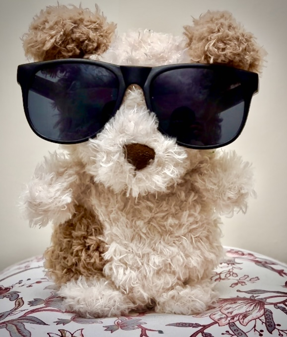

# Lovable

The detailed artistic vision and visual display can be found [here](https://volcano-reason-144.notion.site/Lovable-Robot-s-Love-31582419b5ff4f17adb28b91c18dea4b).

Run Speech Recognition

1. open google colab notebook
2. upload the corresponding audio to colab, namely the hello.wav and bye.mp3
3. start to 'run all' on google colab
      - your audio will be recorded for running speech recognition
      - stop the recoding when finish speaking
4. corresponding response will be played

Connect ESP32 to Laptop

1. upload touch.ino script to ESP32
2. run connect.py on computer
